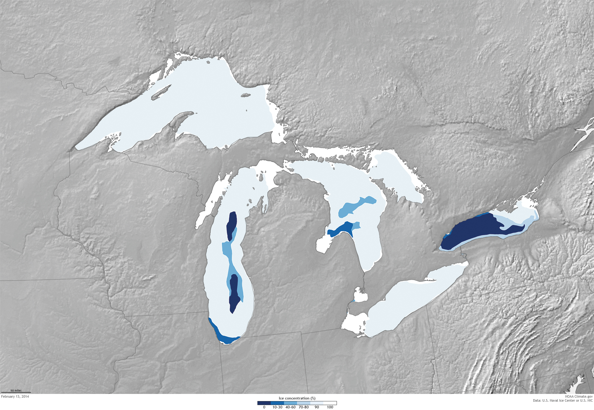

# SMMBBGKJ-TTH-Prj1

6.1 PROJECT REQUIREMENTS
• Two to three plots (and think about getting information visualized onto fewer plots). NO PIE CHARTS
 
• Greater than or equal to two datasets
 
• At least one dataset comes from merging different tables/sources (deliverable)
• At least 1 dirty dataset (not Kaggle)
• Export dataframe to SQL Database
 
• At least one API used

• 10 minute Presention
• No PowerPoint, use JupyterNotebook

API helper application = Postman (free to download):
https://www.getpostman.com/downloads/

# Topic
* What: Ice changes
* Where: Great Lakes
* When: Dec 1992 - Apr 1997
* Other Variables: DT32, DX32
* How: NOAA API

## NOAA API 

* Documentation: https://www.ncdc.noaa.gov/cdo-web/webservices/v2#gettingStarted
* Datasets and their documentation/samples (new) https://www.ncdc.noaa.gov/cdo-web/datasets
* Data Flags to include: https://www.ncei.noaa.gov/support/access-data-service-api-user-documentation
* get API here: https://www.ncdc.noaa.gov/cdo-web/token

* A lot of data is here: https://www.glerl.noaa.gov//data/dashboard/data/
csv and other formats

* ice data: https://www.glerl.noaa.gov/data/dashboard/data/ice/

* other water data (precipitation, evaporation, etc): https://www.glerl.noaa.gov/data/dashboard/data/hydroIO/

* Storm data: https://www1.ncdc.noaa.gov/pub/data/swdi/stormevents/csvfiles/
(because I found it, we don't have to use it.)

### Lake stats
https://coastwatch.glerl.noaa.gov/statistic/physical.html
the 'dirty' dataset (not sure it counts, but the api calls from NOAA may)

### Notebooks
1. lake_stats.ipynb = This pulls the table from the link provided into a dataframe to be cleaned and exported to csv.
2. lake_ice.ipybn = This pulls the 5 lake ice coverage csvs from the ice_data directory downloaded from the site provided. The data is merged into a single dataframe and exported. Another exported csv provides the ranges of dates when data was gathered to be used later.
3. NOAA.ipynb = We started playing with the API here, but since broke the functions out into separate notebooks.
4. datatypes = Where we identified all datapoints available through the NOAA API. This exports a slightly filtered list of variables and the manually selected datapoints.
5. stations.ipynb = Where we identified the stations in bordering states to each great lake. We attempted to filter them further based on coordinates manually added to the lake_stats csv, but ultimately failed. Each lake has it's own csv of stations in bordering states.
6. data.ipynb = Makes the calls to the API based on identified in lake_ice.ipynb, datapoints from datatypes.ipynb, datasets based on the chosen datapoints manually entered. The results are 1 csv per lake, for all datapoints listed, for all date ranges from lake_ice.ipynb. This includes some minor error handling so the api calls will continue if an error is raised. Due to throttling of the API, each call is capped at 1000.

7. SQL.ipynb = exports the cleaned ice_coverage.csv (found in /data_files/clean_data) to a local mysql database

#### Chart Notebooks
1. SAvsMaxCov.ipynb = Surface Area vs Max % Ice Coverage per lake. 
* One would expect to see a decreasing trend: low Surface Area, high Ice Coverage. However this does not appear to be the trend. This would be a better chart with more lakes plotted.
2. plot_api_var.ipynb = Monthly DX32 scaled by % Max Ice Coverage. 
* This shows a pattern of a relatively small but high dot followed by a series of lower but larger dots, often starting in January. This pattern indicates February and March as less cold months, but months with more ice on the lake.
3. DX32_vs_months.ipynb = Year over year for months January through May, the median number of days below freezing.
* As expected, January is a very cold month, while as time passes, things get warmer.
4. DT32vsNumDaysIce.ipynb and DX32vsNumDaysIce.ipynb were attempts to compare how long the ice lasts with the number of days the min and max temperature is at or below freezing respectively. We found we could not accurately calculate the number of days with ice given the data available.
5. plots5lakes.ipynb = Plots the % Ice Coverage and the Number of Days below freezing separately for each lake.

#### Weaknesses
1. We were unable to limit the datapoints from the api to a reasonable area around the lake. Any calculations based on DT32 or DX32 will be skewed for this reason.
2. Inconsistent data available for the % ice coverage for any given lake. The data was gathered across 44 years, stopping quite suddenly in 2016. Initially it appears the % ice coverage was gathered weekly, but as years passed (and funding changed) this frequency also changed. More recently it appears to be gathered daily while there is ice, but once the ice coverage hits 0%, there are no more records until the day before it is greater than 0%.
3. The API documentation did not explain or define the column 'attributes' for each datapoint, which limited what we could use after we selected our target variables and therefore reducing the data we could use.

#### Expansions
1. Year over Year monthly (year round) % ice coverage for a given lake. It would be interesting to see if the coverage is increasing or decreasing over the years. 
2. DX32 vs Number of days with ice on the lake. Attempted, but we couldn't quite get the calculation.
3. Thickness of ice on water vs % Ice coverage. This was a datapoint that should have been available, but wasn't. 
