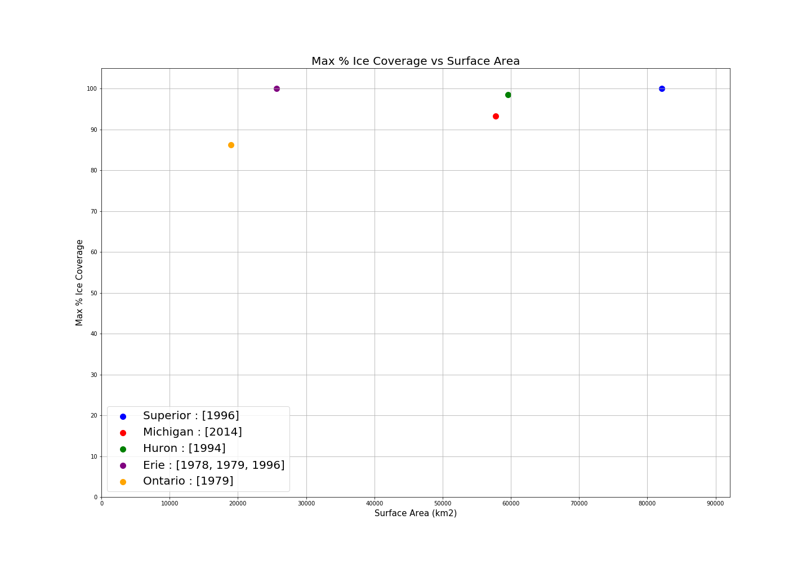
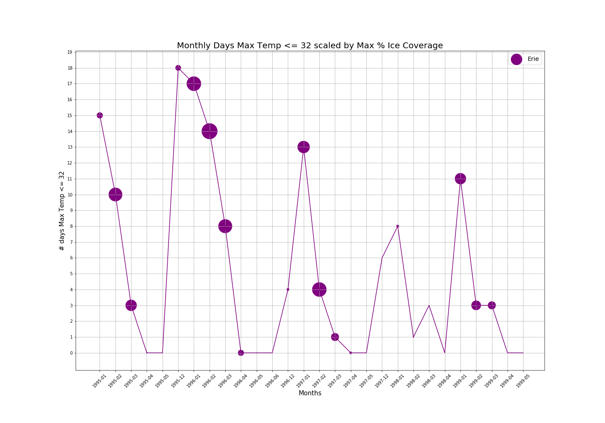
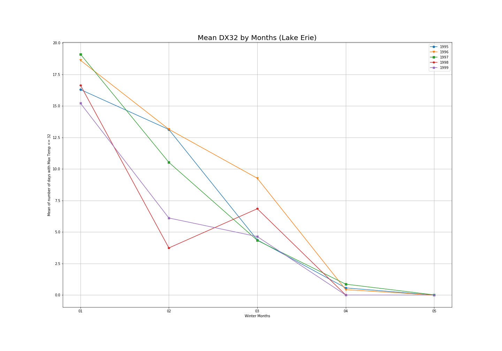

# % Ice Coverage and Days below freezing on the Great Lakes

* What: % Ice Coverage, Number of Days <= 32
* Where: Great Lakes
* When: Jan 1995 - May 1999
* Other Variables: Lake Surface Area
* How: NOAA API

### Great Lakes
1. Lake Superior
2. Lake Michigan
3. Lake Huron
4. Lake Erie
5. Lake Ontario
* Inbetween Erie and Ontario is a much smaller Lake St. Clair, which is not great, just ok.

### Acronyms
* NOAA = National Oceanic and Atmospheric Administration
* DT32 = Number of days the minimum tempurature was <= freezing
* DX32 = Number of days the maximum tempurature was <= freezing

